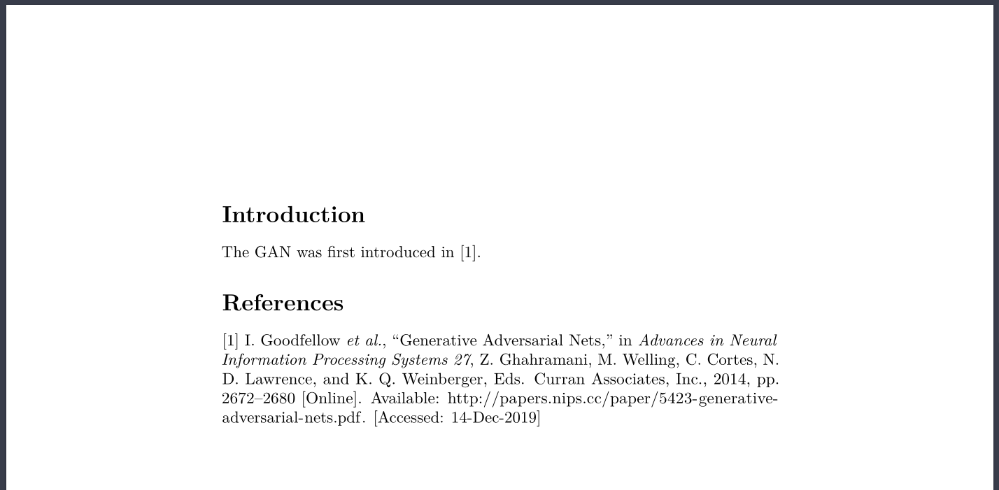

# Introduction

This repo allows you to instantly and transparently cite most papers directly only given a single URL.

You simply add the URL of a publication or of the DOI to the front matter, and it will replace that with a real citation in whatever [CSL](https://citationstyles.org/) style you want.

Here is a minimal example:

**minimal.md**

``` {.markdown .number-lines}
---
citekeys:
    gan: https://papers.nips.cc/paper/5423-generative-adversarial-nets
---

# Introduction

The GAN was first introduced in [@gan].

# References
```

Compiling this file with this command

```bash
pandoc --filter=pandoc-url2cite/index.js \
    --filter=pandoc-citeproc \
    minimal.md \
    --csl ieee.csl \
    -o minimal.pdf
```

This results in the following output:  
**minimal.pdf**  


# How to Use

Clone this repo somewhere, then install the dependencies using `npm ci install`. Then, add `--filter=pandoc-url2cite/index.js` to your pandoc command (before pandoc-citeproc).

If you're not familiar with writing papers in pandoc, you can refer to [this article](https://opensource.com/article/18/9/pandoc-research-paper). It's pretty flexible, you can use templates from whatever conference you want, and you can still use inline latex code if you need it (and you are ok with not being able to convert your document to nice HTML or EPUB anymore).

# How it Works

Awesomely (todo).

# Limitations

Currently, extracting the metadata from direct URLs of full text PDFs does not work. I'm not sure why, since this does work in Zotero.

# Related Work (Longer Example)

AlexNet [@alexnet] first introduced CNNs to the ImageNet challenge. [@vgg; @googlenet; @resnet] further improved on the results.

In [@gan] there is some other interesting stuff.

# References
